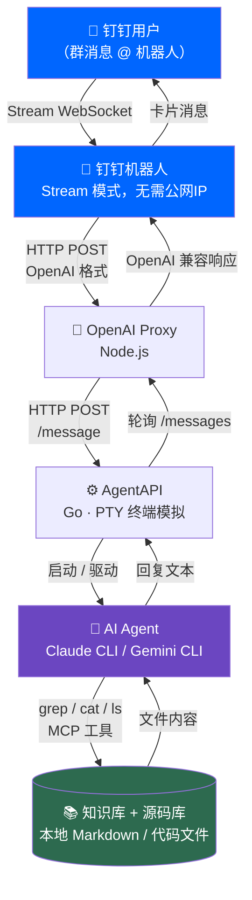
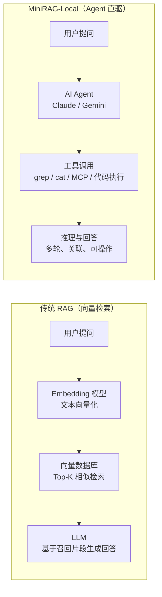

# MiniRAG-Local

**MiniRAG-Local** 是一套基于 AI Agent 的本地知识库问答系统。与传统 RAG 方案不同，它不依赖向量数据库或 Embedding 模型，而是直接驱动本地 AI Agent（Claude / Gemini CLI）对知识库进行实时检索与推理。

---

## 我们能做什么

> 以 NSAG 团队内部部署为例

在钉钉群里 @ 机器人，即可直接查询 **NSAG 产品知识库** 和 **源码库**：

- 查询产品规格、接口定义、设计文档
- 定位某个功能在源码中的具体实现位置
- 分析代码逻辑、解释配置项含义
- 跨文件、跨目录的关联推理（"这个错误码是在哪定义的？调用链是什么？"）
- 直接在对话中生成代码片段、写注释、做 Code Review

```
钉钉群用户
    │  @ 机器人提问
    ▼
钉钉机器人（Stream 模式，无需公网 IP）
    │
    ▼
MiniRAG 钉钉模块（dingtalk/bot.js）
    │  HTTP → OpenAI 兼容接口
    ▼
OpenAI Proxy（proxy/openai_proxy.js）
    │  HTTP → AgentAPI
    ▼
AgentAPI（Go，PTY 终端模拟）
    │  启动并驱动
    ▼
Claude CLI / Gemini CLI
    │  grep / cat / ls / MCP 工具
    ▼
NSAG 知识库 + 源码库（本地文件系统）
```

---

## 架构图



---

## 与传统 RAG 方案的对比



| 维度 | 传统 RAG | MiniRAG-Local |
|------|----------|---------------|
| 检索方式 | 向量相似度 Top-K 召回 | AI Agent 主动文件检索 |
| 部署依赖 | Embedding 模型 + 向量库 | 仅需 AI CLI + Node.js |
| 知识更新 | 需重新 Embedding 索引 | 实时读取，无需预处理 |
| 推理能力 | 受限于召回质量 | Agent 多轮推理，跨文件关联 |
| 扩展工具 | 有限 | 全部 Agent Skills + MCP |
| 并发能力 | 高 | **单并发**（见局限性）|

---

## 优势

### 1. 全部 Agent 能力开箱即用

不是简单的"检索 + 生成"，而是把 AI Agent 完整能力暴露给用户：

- **文件系统工具**：`grep`、`cat`、`find`、`ls` —— 精准定位任意文件内容
- **代码执行**：直接运行脚本、验证逻辑
- **MCP 工具**：Claude / Gemini 支持的所有 MCP Server 均可直接调用（数据库、API、浏览器等）
- **多轮推理**：不是一次检索了事，Agent 会根据中间结果继续深挖

### 2. 极简部署，无需预处理

无需：
- 搭建向量数据库（Chroma / Pinecone / Qdrant）
- 运行 Embedding 服务（OpenAI API / 本地模型）
- 对知识库做索引（文档分块、向量化、入库）

知识库有变更？直接更新文件，下次提问立即生效。

### 3. 强可定制性

- 通过 `STARTUP_PROMPT` 给 Agent 注入角色定义和行为规范
- 通过 `CLAUDE_ARGS` / `GEMINI_ARGS` 自由切换模型参数
- 钉钉群路由（`DINGTALK_RAG_GROUPS`）支持不同群对接不同知识库端点
- 对接任何支持 OpenAI 接口的前端（油猴插件、Cursor、VS Code 等）

---

## 局限性

### ⚠️ 单并发

整套系统**同一时间只能处理一个请求**。

AgentAPI 维护一个 PTY 会话，同一时刻只能运行一个 AI Agent 进程。多个请求同时进来时，后续请求需要排队等待。

**影响场景**：多人同时 @ 机器人时，后发的消息需等前一条处理完才会响应。  
**适用场景**：团队内部低频知识查询、个人助手、演示环境。

### ⚠️ 安全风险

默认启动参数（`--dangerously-skip-permissions` / `--yolo`）赋予 AI Agent 对本地文件系统的完全访问权限，包括读取、执行命令、写入文件。

**请勿在公网或不受信任的环境中暴露服务端口。**

详见下方[安全配置](#安全配置)。

### ⚠️ 响应延迟

Agent 需要实时执行文件检索工具调用，响应时间通常在 **5～30 秒**，远高于传统 RAG 的毫秒级召回。复杂问题（如大型代码库扫描）可能更长。

---

## 安全配置

> 默认配置面向本地开发，生产/演示环境请按需调整。

**方式 1：移除危险参数**
```bash
# .env
CLAUDE_ARGS=   # 去掉 --dangerously-skip-permissions
GEMINI_ARGS=--yolo --include-directories /path/to/safe/folder
```

**方式 2：限制知识库目录**
```bash
WORKSPACE_PATH=/path/to/readonly/knowledge-base
```

**方式 3：容器 / 虚拟机隔离**  
在 Docker 容器或虚拟机中运行，挂载只读知识库目录，与主机文件系统隔离。

---

## 快速开始

### 依赖

- [Node.js](https://nodejs.org/) >= 18
- [AgentAPI](https://github.com/coder/agentapi)（Go 编译）
- [Claude CLI](https://github.com/anthropics/claude-code) 或 [Gemini CLI](https://github.com/google-gemini/gemini-cli)

### 部署步骤

```bash
# 1. 克隆项目
git clone https://github.com/JiangJingC/MiniRAG-Local.git
cd MiniRAG-Local

# 2. 配置环境变量
cp .env.example .env
# 编辑 .env，填入路径和密钥

# 3. 启动
chmod +x scripts/start_ai.sh scripts/stop_ai.sh
./scripts/start_ai.sh          # 默认 claude 模式
./scripts/start_ai.sh gemini   # 使用 gemini
```

启动后服务地址：`http://localhost:62000/v1/chat/completions`（OpenAI 兼容）

### 钉钉群机器人

1. 在[钉钉开发者后台](https://open.dingtalk.com)创建企业内部应用，开启「机器人」能力，连接方式选 **Stream 模式**（无需公网 IP）
2. 在 `.env` 中填入：

```env
DINGTALK_APP_KEY=你的AppKey
DINGTALK_APP_SECRET=你的AppSecret
DINGTALK_RAG_GROUPS={"群conversationId": {"endpoint": "http://localhost:62000/v1/chat/completions", "model": "rag", "timeoutMs": 30000}}
```

3. 重启服务，在钉钉群 @ 机器人即可

**获取 conversationId**：群里 @ 机器人发任意消息，查看日志：
```bash
tail -f /tmp/dingtalk_bot.log
```

### 油猴插件

将 `examples/agent_api_user_script.js` 导入 Tampermonkey，可在任意网页右下角呼出知识库对话框。

---

## 项目结构

```
MiniRAG-Local/
├── proxy/
│   ├── openai_proxy.js      # OpenAI 兼容接口层
│   ├── text-utils.js        # TUI 输出清洗
│   └── env-utils.js         # .env 解析
├── dingtalk/
│   └── bot.js               # 钉钉 Stream 机器人
├── scripts/
│   ├── start_ai.sh          # 一键启动
│   └── stop_ai.sh           # 停止服务
├── examples/
│   └── agent_api_user_script.js  # 油猴插件
├── docs/                    # 技术文档
└── .env.example             # 配置模板
```

---

## 许可证

[MIT License](LICENSE)

---

*MiniRAG-Local — 让 AI Agent 直接成为你的知识库引擎。*
