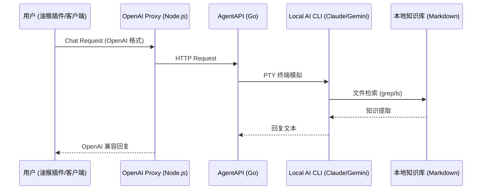

# MiniRAG-Local 🎋

**MiniRAG-Local** 是一个极简、轻量级且完全运行在本地的 RAG（检索增强生成）解决方案。它不依赖向量数据库或复杂的 Embedding 模型，而是通过接入本地终端 AI 助手（如 Claude Code 或 Gemini CLI），直接对本地 Markdown 知识库（如 Obsidian）进行实时检索与问答。

## 🌟 核心特性

- **完全本地化**: 数据无需上传云端向量库，直接索引本地目录。
- **极简架构**: 仅需 `AgentAPI` + 一个简单的 `OpenAI 兼容层`。
- **标准兼容**: 提供 OpenAI 规范接口，可无缝对接任何支持自定义 API 地址的客户端或油猴插件。
- **实时响应**: 利用终端 Agent 原生的文件搜索（grep/cat）能力，实现毫秒级知识定位。

## 🏗️ 架构概览



## ⚠️ 安全警告

**重要提示：默认配置存在安全风险！**

为了开箱即用，本项目的启动脚本默认使用以下参数：

- **Claude**: `--dangerously-skip-permissions` - 跳过所有权限检查
- **Gemini**: `--yolo --include-directories` - 允许访问指定目录的所有文件

### 🚨 风险说明

这些参数会赋予 AI Agent 对本地文件系统的完全访问权限，包括：
- ✅ 读取任何文件
- ✅ 执行任意命令
- ✅ 修改/删除文件
- ✅ 访问敏感数据（密码、密钥等）

### 🛡️ 如何降低风险

**方式 1：移除危险参数**
编辑 `scripts/start_ai.sh`，修改对应的 `AGENT_ARGS`：

```bash
case "$AGENT_TYPE" in
    claude)
        BINARY_PATH="$CLAUDE_BINARY"
        # 移除 --dangerously-skip-permissions
        AGENT_ARGS=""
        ;;
    gemini)
        BINARY_PATH="$GEMINI_BINARY"
        # 移除 --yolo --include-directories
        AGENT_ARGS=""
        ;;
esac
```

**方式 2：限制访问范围**
为 Gemini 指定更具体的目录：

```bash
# 代替 --include-directories $WORKSPACE_PATH
AGENT_ARGS="--include-directories /path/to/safe/folder"
```

**方式 3：使用沙盒环境**
在虚拟机或容器中运行 MiniRAG-Local，与主系统隔离。

### 📌 建议

- 生产环境务必移除或调整危险参数
- 只在受信任的网络环境中使用
- 定期审查 Agent 的操作日志
- 敏感数据（密钥、密码等）不要放在知识库目录

**你了解这些风险了吗？请根据实际需求调整配置。**

---

## 🚀 快速开始

### 1. 环境准备
- 安装 [AgentAPI](https://github.com/coder/agentapi)
- 安装本地 AI 命令行工具（推荐 [Claude Code](https://github.com/anthropics/claude-code) 或 [Gemini CLI](https://github.com/google-gemini/gemini-cli)）
- 确保系统已安装 `Node.js`

### 2. 部署步骤
1. **克隆本项目**:
   ```bash
   git clone https://github.com/JiangJingC/MiniRAG-Local.git
   cd MiniRAG-Local
   ```
2. **配置环境变量**:
   复制并修改 `.env.example` 为 `.env`，填入您的本地路径：
   ```bash
   cp .env.example .env
   # 编辑 .env 文件，修改路径
   ```
3. **一键启动**:
   ```bash
   chmod +x scripts/start_ai.sh
   ./scripts/start_ai.sh
   ```

### 3. 前端集成
您可以将 `examples/agent_api_user_script.js` 导入到浏览器的 **Tampermonkey** 插件中，即可在任何网页右下角呼出您的个人知识库对话框。

## 📁 项目结构
- `proxy/`: OpenAI 协议转换层 (Node.js)
- `scripts/`: 服务启动与管理脚本
- `examples/`: 包含油猴插件等前端示例代码
- `docs/`: 详细的技术文档与进阶配置指南

## 🛡️ 许可证
[MIT License](LICENSE)

---
*Powered by MiniRAG-Local - 简单、私密、高效。*
